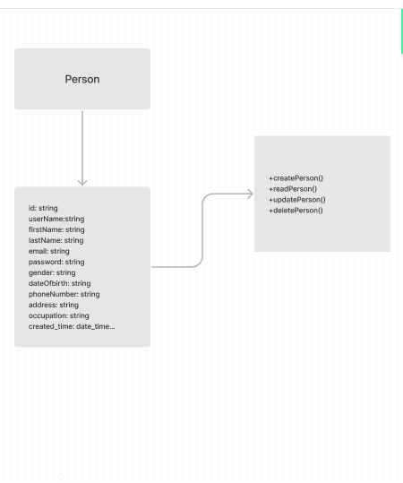
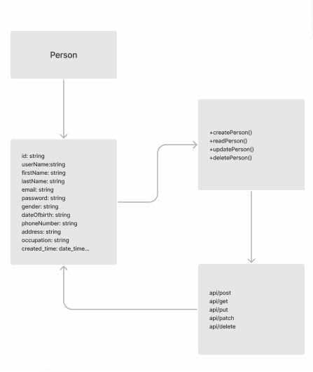

# A RESOURCE API

# A REST API with Node.js, Postgres & TypeScript

## Project Overview:

A simple REST API capable of CRUD operations on a "PERSON" resource.

* This project provides a simple REST API for managing person records, allowing you to perform CRUD (Create, Read, Update, Delete) operations. 
* This README.md file contains detailed instructions on setting up, running, and using the API.

Postman Documentation [postman collection for the finished API](https://documenter.getpostman.com/view/27252655/2s9YC31tnR)

Documentation File [DOCUMENTATION](https://github.com/fesimaxu/HNGxProjects/blob/main/resourceAPI/Documentation.md)

Postman Automated test script [TEST](https://github.com/fesimaxu/HNGxProjects/blob/main/resourceAPI/script/postmanTest.pm)

Live link is hosted on [LIVE-LINK](https://resourceapi.onrender.com/api/users)

Added .env, and node_modules to my .gitignore before pushing any changes to your repository.

## Common issues

- Managing environment variables

## Architecture:

Backend Framework: Node.js with Express.js
Database: Json File for storing account data
API Documentation: Postman for clear API documentation
Validation: joi for user's Json payload validation
Version Control: Git and GitHub for collaborative development
Deployment: Render for hosting

## Concepts

- REST API principals
  - CRUD
  - HTTP methods
- Request validation

## Technologies

- Yarn
- TypeScript
- Express.js & Express.js middleware
- Joi validation

## Table of Contents

- [Model Diagrams](#model-diagrams)
- [Prerequisites](#prerequisites)
- [Getting Started](#getting-started)
  - [1. Install Dependencies](#2-install-dependencies)
  - [2. Run the API Locally](#3-run-the-api-locally)
- [API Endpoints](#api-endpoints)
- [Request/Response Formats](#requestresponse-formats)
- [Known Limitations and Assumptions](#known-limitations-and-assumptions)
- [Deployment](#deployment)

## Model Diagrams

- Unified Modeling Language (UML)
> 

-  Entity-Relationship Diagram (ERD)
> 


## Prerequisites

- An IDE or text editor (VS Code)
- Node.js 16.0 or higher version installed
- Postman
- A package manager such as NPM or Yarn
- Git installed for Collobration

## Getting Started

- Follow these steps to set up and run the API locally.

1. Create a new folder: ResourceAPI

```node js
    cd ResourceAPI
    yarn init -y
```

2. Install Dependencies

- Install the required Node dependencies using Yarn add:

```node js
    yarn add express morgan cookie-parser
```

- Install the necessary Dev Dependencies

```node js
    yarn add --dev typescript @types/express nodemon
```

- This will install node and any other necessary packages.

3. Run the API Locally

- To run the API locally, use the following command:

```Typescript

    yarn watch -- compile
    yarn dev or yarn prod -- to run server
```

- This will start the API server, and it will be available at

```Typescript
http://localhost:6000/api
```

## Folder Structure:

- src: Contains the application source code.
- controllers: Handle request and response logic.
- models: Define database models.
- routes: Define API endpoints.
- config: Store configuration files.
- tests: Contains Postman Automation test script
- docs: Stores API documentation files.

## Design Structure

## Database Design:

- Postgres: Create data and storing user data.
- Data: Store account information (e.g., User's Personal to create, read, update and delete ).

## API Endpoints:

## Endpoint 1: Create a New User (POST /api/createuser)

- Receives JSON payload with user details.
- Validates data.
- create a new user.
- Stores data in the database.
- Responds with a user details.

## Endpoint 2: Read a user detail (GET /api/users/{user_id})

- Responds with a user's details.

## Endpoint 3: Get all users details (GET /api/users)

- Responds with an array of all persons details.

## Endpoint 4: Update all Person's details (PUT /api/users/update/{user_id})

- Receives JSON payload with user details.
- update a person detail.
- Stores data in the database.
- Responds with a user details.

## Endpoint 5: Update a property of Person's details (PATCH /api/update/{user_id})

- Receives JSON payload with user details.
- update a property of a user's details.
- Stores data in the database.
- Responds with a user details.

## Endpoint 6: Delete all Person's details (DELETE /api/delete/{user_id})

- Receives a param of id.
- Responds deletes the person's details.

## Request/Response Formats

### Create a Person (POST /api/)

**Request Format:**

```javascript
requests

baseurl = "http://localhost:6000/api/createuser"

request.body = {
    "userName": "igwekode",
    "firstName": "uchenna",
    "lastName": "igwe",
    "email": "fesimaxu54r40@gmail.com",
    "dateOfBirth": "18-10-2000",
    "gender": "male",
    "password": "myPassword30",
    "repeat_password": "myPassword30",
    "phoneNumber": "08134586193",
    "address": "30 oforkarie st. ago",
    "occupation": "developer"
}

response = requests.post(baseurl, json=data)
return response
```

**Response Format (Success - 200):**

```json
{
  "status": "success",
  "method": "POST",
  "message": "user successfully created",
  "data": {
    "id": "555539da-c7c8-4d49-b244-8cebf5d05114",
    "userName": "igwekode",
    "firstName": "uchenna",
    "lastName": "igwe",
    "gender": "male",
    "dateOfBirth": "18-10-2000",
    "email": "fesimaxu54r40@gmail.com",
    "address": "30 oforkarie st. ago",
    "phoneNumber": "08134586193",
    "occupation": "developer",
    "createdAt": "2023-09-12T12:48:33.109Z",
    "updatedAt": "2023-09-12T12:48:33.109Z"
  }
}
```

**Response Format (Bad request - 400):**

```json
{
  "status": "error",
  "method": "POST",
  "message": "user already exists"
}
```

### Read a Person (GET /api/users/{user_id})

**Request Format:**

```javascript
requests

baseurl = "http://localhost:6000/api/users/id"
response = requests.get(api_url)
return response
```

**Response Format (Success- 200):**

```json
{
  "status": "success",
  "method": "GET",
  "message": "User details",
  "data": {
    "id": "ff406763-4745-4989-9ab6-90c0509b499f",
    "userName": "igwekode30",
    "firstName": "uchenna",
    "lastName": "igwe",
    "gender": "male",
    "dateOfBirth": "15-10-1992",
    "email": "fesimaxu54r0@gmail.com",
    "phoneNumber": "08134586193",
    "address": "30 oforkarie st. ago",
    "occupation": "developer",
    "createdAt": "2023-09-11T13:29:50.588Z",
    "updatedAt": "2023-09-12T09:08:54.755Z"
  }
}
```

**Response Format (Not Found - 404):**

```json
{
  "status": "error",
  "method": "GET",
  "message": "user does not exists"
}
```

### Update a Person (PUT /api/{user_id})

**Request Format:**

```javascript
requests

baseurl = "http://localhost:6000/api/users/update/{user_id}"

body ={
    "userName": "igwekode30",
    "firstName": "uchenna",
    "lastName": "igwe",
    "email": "fesimaxu54r0@gmail.com",
    "dateOfBirth": "15-10-1992",
    "gender": "male",
    "password": "myPassword30",
    "repeat_password": "myPassword30",
    "phoneNumber": "08134586193",
    "address": "30 oforkarie st. ago",
    "occupation": "developer"
}
response = requests.get(api_url)
return response

```

**Response Format (Success - 200):**

```json
{
  "status": "success",
  "method": "PUT",
  "message": "user updated successfully"
}
```

**Response Format (Not Found - 404):**

```json
{
  "detail": "User does not exist"
}
```

### Delete a Person (DELETE /api/{user_id})

**Request Format:**

```nodejs
requests

baseurl = "http://localhost:6000/api/delete/{user_id}"

response = requests.delete(api_url)
return
```

**Response Format (Success - 200):**

````json
{
    "status": "success",
    "method": "Delete",
    "message": "user deleted successfully"
}

**Response Format (Bad Request - 400):**
```json
{
  "message": "User does not exist"
}
````

## Testing:

- An automated Postman scripting test

## Documentation:

- Generate API documentation using Postman or a similar tool.
- Include detailed information about how to use each endpoint

## Versioning:

- Implement API versioning to ensure backward compatibility.

## Known Limitations and Assumptions:

- Input validation is handled by Node package dependency JOI in this task.
- Implement more robust validation and error handling in a production-ready application.
- Authentication and authorization mechanisms are not implemented here. Ensure secure access to your API in a real-world scenario.
- This documentation assumes that you have successfully set up the API locally.

## Deployment

- To deploy this API to a production server, follow the appropriate deployment practices for NODE JS applications. Ensure proper security measures, such as using HTTPS, implementing authentication, and securing sensitive data.
